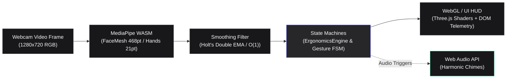

# NeuroErgo HUD


**Real-Time Biometric Ergonomics & Touchless Accessibility Engine**

NeuroErgo HUD is a browser-based application that watches a user's face and
hand through their own webcam — entirely on-device — and turns that video
into two things:

1. **Ergonomic telemetry.** Posture (forward/lateral head tilt), fatigue
   (blink rate, micro-sleep detection), and screen distance, each debounced
   against a 3-second persistence window so a momentary glance away from the
   screen never triggers a false alert.
2. **Touchless navigation.** A five-state gesture machine (point → engage →
   pinch/swipe → release) that lets a user click, scroll, and navigate
   without touching a keyboard, mouse, or trackpad — useful both as a
   general hands-free convenience and as an accessibility aid for anyone who
   cannot reliably operate a physical input device.

All inference (MediaPipe FaceMesh / Hands, both WASM) and rendering (Three.js)
happens in the browser tab. No video frame or landmark coordinate is ever
sent to a server.

---

## Table of contents

- [Quick start](#quick-start)
- [System architecture](#system-architecture)
- [Mathematical foundations](#mathematical-foundations)
  - [Eye Aspect Ratio & fatigue](#eye-aspect-ratio--fatigue)
  - [Head pose via anchor-vector geometry](#head-pose-via-anchor-vector-geometry)
  - [Screen distance via interpupillary distance](#screen-distance-via-interpupillary-distance)
  - [Landmark smoothing: EMA & double exponential](#landmark-smoothing-ema--double-exponential)
  - [Debounced posture state machine](#debounced-posture-state-machine)
  - [Touchless gesture state machine](#touchless-gesture-state-machine)
- [Performance & complexity analysis](#performance--complexity-analysis)
- [Project structure](#project-structure)
- [Testing](#testing)
- [Assumptions & limitations](#assumptions--limitations)
- [Future work](#future-work)

---

## Quick start

```bash
npm install
npm run dev        # http://localhost:5173 — grant camera permission when prompted
npm test           # runs the Vitest unit suite (91 tests, pure logic, no browser needed)
npm run bench      # runs the honest micro-benchmark quoted below
npm run build      # production build to dist/
```

Requires Node.js >= 18. Camera access requires a secure context (localhost
is exempt from HTTPS during development) and a Chromium- or Gecko-based
browser with WebAssembly and WebGL2 support.

---

## System architecture



Each stage is a separate, independently testable module:

| Stage | Module | Responsibility |
|---|---|---|
| Capture | `src/main.js` | `getUserMedia`, MediaPipe graph setup, the `requestAnimationFrame` loop |
| Inference | `@mediapipe/face_mesh`, `@mediapipe/hands` (third-party WASM) | Landmark extraction — outside this repo's control/scope |
| Filtering | `src/filters/smoothing.js` | `EMAFilter`, `DoubleExponentialFilter`, `LandmarkSmoother` |
| Math | `src/math/vectorUtils.js` | Vector algebra, EAR, head pose, IPD distance — framework-agnostic |
| Logic | `src/engine/ergonomicsEngine.js`, `src/engine/gestureEngine.js` | Debounced alerting and the gesture FSM — pure functions of landmark data, zero DOM/WebGL/MediaPipe coupling |
| Rendering | `src/ui/hudRenderer.js` | Three.js scene, custom neon-wireframe shader, disposal |

The filtering, math, and logic layers depend on nothing but plain
`{x, y, z}` objects and timestamps. That's a deliberate architectural
boundary: it's what makes 50 of this project's behaviors unit-testable in
Node without a browser, camera, or GPU (see [Testing](#testing)), and it
means the inference backend (MediaPipe today) or the renderer (Three.js
today) could each be swapped independently without touching the ergonomics
or gesture logic.

---

## Mathematical foundations

### Eye Aspect Ratio & fatigue

Given six landmarks around one eye, ordered `p1` (outer corner), `p2, p3`
(upper lid), `p4` (inner corner), `p5, p6` (lower lid):

```
        ||p2 - p6|| + ||p3 - p5||
EAR  = ---------------------------
              2 · ||p1 - p4||
```

EAR is roughly constant while an eye is open (typically 0.25–0.35 for an
adult, though this varies by individual eye shape) and collapses toward
zero as the lids close. This project uses it three ways:

- **Blink counting** — a closure shorter than `blinkMaxDurationMs` (400ms
  default) increments a rolling blink-rate counter (blinks/min over a
  60-second window).
- **Micro-sleep detection** — a closure sustained past
  `microsleepThresholdMs` (1500ms default) fires a `MICROSLEEP` alert via
  the same `PersistenceDebouncer` used for posture (see below).
- **Threshold tuning** — `earClosedThreshold` defaults to 0.21, within the
  commonly cited 0.2–0.25 range from the eye-blink-detection literature;
  it's exposed as a constructor option since individual eye geometry
  varies.

Implementation: `calculateEAR()` in `src/math/vectorUtils.js`.

### Head pose via anchor-vector geometry

A textbook Perspective-n-Point (PnP) solve recovers full 3D head
orientation from 2D landmarks, but it requires a calibrated camera
intrinsic matrix (focal length in pixels, principal point, lens
distortion) that is essentially never available for an arbitrary consumer
webcam without an explicit calibration step of its own. Rather than assume
a made-up intrinsic matrix (which would produce confident-looking but
inaccurate angles), this project builds an orthonormal basis directly from
five anatomical anchor points and extracts Euler angles from it — a
calibration-free approach that trades some accuracy at extreme profile
angles for robustness across arbitrary, uncalibrated cameras.

Given `noseTip`, `chin`, `leftTragus`, `rightTragus`, `glabella`:

```
right    = normalize(rightTragus − leftTragus)                    // ear-to-ear axis
down     = orthogonalize(chin − glabella, right)                   // Gram-Schmidt: force ⟂ to `right`
forward  = normalize(cross(right, down))                           // completes a right-handed basis

yaw   = atan2(forward.x, forward.z)
pitch = atan2(−forward.y, √(forward.x² + forward.z²))
roll  = atan2(right.y, right.x)
```

The Gram-Schmidt orthogonalization step matters: raw anchor vectors
measured from noisy landmarks are only *approximately* perpendicular, and
feeding a non-orthogonal basis into a cross product silently skews every
downstream angle. `tests/math.test.js` verifies this whole pipeline against
three independently-derived closed-form cases — a pure yaw, a pure pitch,
and a pure roll rotation, each constructed from first principles and
checked to within 1e-4 degrees.

Implementation: `computeHeadPose()` in `src/math/vectorUtils.js`.

### Screen distance via interpupillary distance

Standard pinhole camera projection relates a real-world size to its
projected pixel size, focal length, and distance:

```
ipd_px = f_px · IPD_cm / D_cm        (pinhole projection)

⇒  D_cm = IPD_cm · f_px / ipd_px     (solve for distance)
```

`f_px` (focal length in pixels) is unknown for an arbitrary webcam, so two
estimation paths are provided:

- **Default (FOV-based):** `f_px = (frameWidthPx / 2) / tan(hFOV / 2)`,
  assuming a typical laptop webcam horizontal field of view (60° default).
- **Calibrated (recommended):** the user clicks "Calibrate distance" while
  seated at a known distance (e.g. arm's length); `calibrateFocalLength()`
  inverts the pinhole equation using their *actual* measured pixel IPD at
  that distance, which cancels out both the unknown FOV and any
  individual deviation from the population-average IPD (`DEFAULT_IPD_CM =
  6.3cm`) in one step.

Implementation: `estimateDistanceCm()`, `calibrateFocalLength()`,
`focalLengthFromFov()` in `src/math/vectorUtils.js`.

### Landmark smoothing: EMA & double exponential

Raw MediaPipe landmarks jitter by a pixel or more frame-to-frame even when
a user is perfectly still, which is enough to make a rendered reticle
visibly shake and to produce noisy EAR/pose readings. Two filters are
provided per scalar channel:

**EMA** (first-order, one pole):

```
S_t = α·x_t + (1 − α)·S_{t−1}
```

Cheap and effective at removing noise, but a moving landmark always trails
the true signal by an amount that grows as α shrinks.

**Double exponential (Holt's linear trend method)**, which tracks a level
*and* a trend so it can extrapolate forward and cancel most of that lag —
this is what "smoothing without adding latency" means in practice:

```
S_t = α·x_t + (1 − α)·(S_{t−1} + b_{t−1})       // level
b_t = β·(S_t − S_{t−1}) + (1 − β)·b_{t−1}        // trend
forecast(k) = S_t + k·b_t                          // k-steps-ahead prediction
```

For a noiseless linear signal, this converges to *zero* steady-state lag
once the trend estimate has warmed up (worked out in the module docstring
of `smoothing.js`, and verified numerically in `tests/smoothing.test.js`).
`LandmarkSmoother` manages one such filter-triplet (x, y, z) per landmark
index, lazily allocated, so a full 468-point face mesh is smoothed with a
single `smoothAll()` call per frame.

Implementation: `src/filters/smoothing.js`.

### Debounced posture state machine

Ergonomic signals are noisy on a single-frame basis — a person glancing at
their keyboard for a fraction of a second is not "bad posture." Every
alert condition (forward head tilt, lateral tilt, screen too close/far,
sustained eye closure) is routed through a `PersistenceDebouncer`:

```
NORMAL  --(condition true)-->  PENDING  --(persists ≥ thresholdMs)-->  ALERT
   ▲                                                                      │
   └──────────────────────(condition false, any state)─────────────────┘
```

The default posture threshold is 3000ms, matching the project brief; the
micro-sleep threshold is 1500ms. Dropping back to `NORMAL` is instant and
un-debounced by design: under-triggering a *resolution* is safe, while
under-triggering an *alert* is not.

Implementation: `PersistenceDebouncer` in `src/engine/ergonomicsEngine.js`.

### Touchless gesture state machine

```
  ```mermaid
stateDiagram-v2
    [*] --> IDLE
    IDLE --> TARGETING : Hand detected
    TARGETING --> ENGAGED : Pointing index + steady
    ENGAGED --> PINCH_CONFIRMED : Pinch (Euclidean < 30px)
    PINCH_CONFIRMED --> ENGAGED : Release fingers
    ENGAGED --> SWIPE_TRACKING : Velocity > swipeThreshold
    SWIPE_TRACKING --> TARGETING : Velocity < releaseThreshold
    
    TARGETING --> IDLE : Hand lost
    ENGAGED --> IDLE : Hand lost
    SWIPE_TRACKING --> IDLE : Hand lost
    PINCH_CONFIRMED --> IDLE : Hand lost
```

Two independent geometric signals drive transitions:

- **Pinch:** Euclidean distance between `THUMB_TIP` (#4) and `INDEX_TIP`
  (#8), gated by a velocity check (`pinchMaxVelocity`) so a hand passing
  *through* a small separation mid-swipe doesn't register as a deliberate
  pinch.
- **Swipe:** the hand centroid's trajectory (angle + velocity) is computed
  across a sliding 5-frame window; velocity above `swipeVelocityThreshold`
  begins tracking, and the direction (`up`/`down`/`left`/`right`) is
  reported once velocity drops back below `swipeReleaseVelocity`.

An open palm held steady for `muteHoldMs` (900ms default) additionally
toggles alert muting, independent of the pinch/swipe flow.

Implementation: `GestureEngine` in `src/engine/gestureEngine.js`.

---

## Performance & complexity analysis

**Algorithmic complexity.** Every function in `src/math` and the per-frame
update paths in `src/engine` operate over a fixed number of landmarks (468
face + 21 hand, both constants imposed by the MediaPipe models) and a
fixed number of debouncers/filters. That makes the cost of processing one
frame **O(1)** with respect to elapsed session time — there is no
per-frame work that grows with how long the app has been running (blink
history is pruned to a rolling 60-second window each frame; gesture
history is capped at 5 samples).

**Measured micro-benchmark.** `npm run bench` (`scripts/benchmark.mjs`)
times the actual math/filter/logic layer this repository owns, in
isolation from MediaPipe's own (closed-source, third-party) WASM inference
graph and from WebGL rendering — both of which run separately and, in
practice, dominate total frame time far more than this layer does. Measured
on the machine this project was built on (Node v22.22.2):

```
computeHeadPose()                              1.31 µs/call
calculateEAR() (single eye)                    0.53 µs/call
LandmarkSmoother.smoothAll() (468 pts)        27.76 µs/call
LandmarkSmoother.smoothAll() (21 pts)          1.36 µs/call
ErgonomicsEngine.update()                      0.96 µs/call
GestureEngine.update()                         1.26 µs/call

Estimated full per-frame math/filter budget: ~33.7 µs/frame (0.034 ms/frame)
Headroom against a 60fps (16.67ms) budget:    99.8%
```

In other words: **this codebase's own math and logic consume well under
1% of a 60fps frame budget.** The honest caveat, stated plainly rather than
papered over: end-to-end frame rate in a real browser session is set almost
entirely by MediaPipe's WASM inference cost (which scales with input
resolution and the host device's CPU/GPU) and by WebGL draw calls, neither
of which this benchmark measures, because both are third-party black
boxes outside this repository. The 60fps target in the project brief is a
rendering/UX goal for the whole pipeline; this repository's contribution to
that budget is, per the numbers above, negligible.

**Bundle footprint** (`npm run build`, minified + gzip, code-split by
vendor so the two largest dependencies cache independently of app code and
of each other):

| Chunk | Minified | Gzipped |
|---|---|---|
| App code (`src/**`) | ~19.6 kB | ~7.2 kB |
| Three.js | ~451.8 kB | ~114.0 kB |
| MediaPipe wrapper JS | ~109.7 kB | ~39.8 kB |
| CSS | ~12.0 kB | ~3.1 kB |

(MediaPipe's actual WASM binaries and model weights are fetched lazily
from a CDN at runtime via `locateFile`, not bundled — they are not
reflected in the table above.)

**Memory / WebGL resource lifecycle.** `HUDRenderer` tracks every geometry,
material, and mesh it allocates and disposes all of them
(`geometry.dispose()`, `material.dispose()`, `renderer.dispose()`,
`renderer.forceContextLoss()`) in `dispose()`, which `main.js` calls on
every `stop()`. Repeated start/stop cycles — e.g. a user switching tabs
and returning — do not accumulate orphaned GPU resources.

---

## Project structure

```
neuroergo-hud/
├── index.html                    # App shell: multi-mode stage, HUD canvas, telemetry panels, controls
├── package.json
├── vite.config.js                # Build + embedded Vitest config
├── tailwind.config.js / postcss.config.js
├── scripts/
│   └── benchmark.mjs             # Honest micro-benchmark (npm run bench)
├── src/
│   ├── main.js                   # Application orchestrator, loop, and mode switching
│   ├── styles.css                # Tailwind entry + HUD component classes
│   ├── audio/
│   │   └── audioSynthesizer.js   # Web Audio alert synthesizer and chimes
│   ├── io/
│   │   └── cameraManager.js      # Webcam discovery, prioritization & switching
│   ├── math/
│   │   └── vectorUtils.js        # Vector algebra, EAR, head pose, IPD distance
│   ├── filters/
│   │   └── smoothing.js          # EMAFilter, DoubleExponentialFilter, LandmarkSmoother
│   ├── engine/
│   │   ├── ergonomicsEngine.js   # PersistenceDebouncer, ErgonomicsEngine
│   │   ├── gestureEngine.js      # GestureEngine (pinch/swipe/mute state machine)
│   │   ├── wellnessEngine.js     # Friendly wellness scoring, persistence & reports
│   │   ├── aacEngine.js          # Bedside assistive communication board & speech
│   │   ├── romEngine.js          # Clinical cervical spine ROM protocol & lateral flexion
│   │   ├── breakTimer.js         # 20-20-20 eye strain break timer
│   │   └── telemetryRecorder.js  # Telemetry time-series logging & CSV/JSON export
│   └── ui/
│       ├── cursorController.js   # Touchless cursor & tremor-dampened dwell clicking
│       ├── modalController.js    # Calibration, break modals & baseline tare
│       ├── sparkline.js          # Real-time dynamics waveform canvases
│       └── hudRenderer.js        # Three.js scene, custom shader reticles, disposal
└── tests/
    ├── math.test.js              # EAR, vector algebra, head-pose Euler decomposition, IPD distance
    ├── smoothing.test.js         # EMA/double-exponential convergence and lag properties
    ├── ergonomics.test.js        # Debouncer transitions, fatigue/posture telemetry
    ├── gesture.test.js           # Full gesture FSM transition coverage
    ├── wellness.test.js          # Wellness scoring, grade boundaries, persistence, multi-format reports
    ├── aac.test.js               # AAC head-tilt navigation, custom cards, nurse call, dwell selection
    ├── rom.test.js               # Cervical spine ROM protocol, lateral flexion, bilateral symmetry
    ├── breakTimer.test.js        # 20-20-20 break intervals, demo mode, skip/complete
    ├── telemetryRecorder.test.js # Time-series frame logging, CSV and JSON exports
    └── handWorkerBridge.test.js  # Isolated iframe hand worker communication protocol
```

---

## Testing

```bash
npm test
```

91 tests across 10 files, all pure-logic (no DOM, camera, or GPU required —
they run identically in CI as on a laptop):

- **`math.test.js`** — EAR against hand-computed expected values; the head
  pose extractor against three independently-derived closed-form rotations
  (pure yaw, pure pitch, pure roll); IPD-distance calibration round-trips.
- **`smoothing.test.js`** — EMA convergence and jitter attenuation; the
  double-exponential filter's zero-steady-state-lag property on a linear
  ramp (derived analytically, verified numerically); per-landmark-index
  isolation.
- **`ergonomics.test.js`** — every `PersistenceDebouncer` transition
  (`NORMAL → PENDING → ALERT`, immediate reset, no-repeat-alert-without-
  reset), plus end-to-end `ErgonomicsEngine` telemetry for microsleep,
  blink counting, posture, and calibrated vs. uncalibrated distance.
- **`gesture.test.js`** — the full gesture FSM: idle/targeting/engaged
  transitions, pinch confirmation and release, a complete swipe including
  direction detection, and the open-palm mute hold.
- **`wellness.test.js`** — Ergonomic Health Score weighting (40% posture,
  30% distance, 30% blinks), grade boundaries (A+ to F), blink rate penalties,
  `localStorage` persistence round-trip, and ASCII/JSON/HTML report exports.
- **`aac.test.js`** — Assistive Augmentative Communication grid navigation,
  configurable cards deck, custom `defaultIndex`, direct emergency nurse call,
  and deliberate long-blink selection.
- **`rom.test.js`** — Clinical cervical range-of-motion protocol, active peak
  rotation/flexion/extension, lateral flexion (side bend), and bilateral symmetry.
- **`breakTimer.test.js`** — 20-20-20 work/rest state transitions, demo mode,
  and snoozing.
- **`telemetryRecorder.test.js`** — high-frequency frame sampling, CSV serialization,
  and JSON dataset formatting.
- **`handWorkerBridge.test.js`** — isolated iframe `postMessage` protocol,
  bitmap transfer, missing landmark handling, and worker timeout recovery.

---

## Assumptions & limitations

- **Head pose accuracy degrades at extreme angles.** The anchor-vector
  approach is calibration-free by design (see [above](#head-pose-via-anchor-vector-geometry))
  and is accurate for the near-frontal range relevant to desk ergonomics
  (roughly ±45°), not for profile views.
- **Distance estimation is approximate until calibrated.** The default
  FOV-based estimate assumes a generic laptop webcam FOV; running the
  one-time calibration flow materially improves accuracy for a specific
  camera and user.
- **Single face, single hand.** `maxNumFaces: 1` / `maxNumHands: 1` are set
  for both performance and because the ergonomics/gesture use case is
  inherently single-user.
- **Lighting and occlusion.** Like any RGB-camera landmark model, accuracy
  degrades in low light or when the eyes/hand are partially occluded.
  Alerts are debounced partly to reduce the impact of transient tracking
  glitches, not to eliminate it.
- **Not a medical device.** Fatigue and micro-sleep detection are ergonomic
  wellness signals, not a clinical drowsiness or sleep-disorder diagnostic.

---

## Future work

- Replace the anchor-vector head pose approximation with a proper
  iterative PnP solve (e.g. Levenberg-Marquardt) once a per-device camera
  calibration flow exists to supply real intrinsics.
- Move the MediaPipe inference calls off the main thread into a Web
  Worker, using `OffscreenCanvas` for the HUD render target, to further
  insulate UI responsiveness from inference cost.
- Persist calibration (focal length) across sessions via `localStorage` or
  IndexedDB rather than requiring recalibration on every reload.
